# Project Showcase Platform — Architecture & Data Design

**Status:** proposal / v1 — **now implemented.** See [`../README.md`](../README.md)
for setup and for the handful of places the build deliberately deviates from this
document (auth, i18n and the rich-text editor are hand-rolled rather than pulled from
libraries). The shipped schema is `prisma/schema.prisma`; `schema.prisma` in this
folder is the original design draft.

**Superseded on 2026-07-28:** the pricing module described below was removed at the
client's request — no price columns on `projects`, no `PriceDisplayMode` enum, no
`pricing_plans` / `pricing_plan_translations` tables, no `/pricing` route or admin
page, and no `modules.pricing` setting. The sections on pricing are kept here as a
record of the original design; `prisma/schema.prisma` is authoritative. The site is
now named **Smart City Research Center** (`settings.site.name`, editable per language
in the admin panel).
**Scope:** one standalone bilingual (TH/EN) project-showcase site with its own PostgreSQL database and admin panel, designed to be re-used as a template for future sites of the same shape.

---

## 0. Key decisions at a glance

| Question | Decision | Why |
|---|---|---|
| Framework | **Next.js 15 (App Router) + TypeScript** | One codebase serves public site, admin panel and API. SSR/ISR gives real SEO for a marketing/showcase site. |
| DB access | **Prisma** on PostgreSQL | Typed schema, first-class migrations, easy to hand over. |
| i18n | **`next-intl`**, locale in the URL path (`/th/...`, `/en/...`) | Explicit, cacheable, SEO-correct. |
| Translation storage | **Side tables** (`project_translations`, `category_translations`, …) | Adding a 3rd language = rows, not migrations. |
| Flexible fields | **Fixed columns + JSONB + admin-defined field registry** (3 layers) | Avoids both rigid schemas and unqueryable EAV soup. |
| Project ↔ Category | **Many-to-many join table** with an `is_primary` flag | Brief requires multi-category; primary flag keeps breadcrumbs/canonical URLs deterministic. |
| Price | **`price_display_mode` enum**, not a boolean | Covers hidden / exact / "from X" / range / on-request without future migrations. |
| Optional modules (Pricing page etc.) | **`settings` feature flags**, read at render time | Toggle per deployment, no code fork. |
| Quote form | **Field-definition table + JSONB submission snapshot** | Fields can be added by admin later; old submissions stay readable forever. |
| Auth | **Auth.js (NextAuth) credentials + bcrypt/argon2**, DB sessions | Admin-only, small user count, no external IdP needed. |

---

## 1. Sitemap

### 1.1 Public site

Every public route is prefixed with the locale segment.

```
/                                   → redirect to /{detected-or-default-locale}
/{locale}                           Homepage
  ├─ hero / intro
  ├─ featured projects
  ├─ categories overview
  └─ CTA → request a quote
/{locale}/projects                  Project listing
  ├─ ?category=<slug>               filter by category (multi-select, repeatable param)
  ├─ ?q=<text>                      keyword search        (optional, phase 2)
  ├─ ?sort=newest|name|price        sorting               (optional)
  └─ ?page=<n>                      pagination
/{locale}/projects/{project-slug}   Project detail
  ├─ image gallery
  ├─ description / features (rich text + feature list)
  ├─ price block            [shown only if price_display_mode ≠ hidden]
  ├─ attachments block      [shown only if public attachments exist]
  ├─ custom spec fields     [driven by field registry]
  ├─ "Request a quote" CTA  → /{locale}/quote?project={slug}
  └─ related projects (same category)
/{locale}/categories/{category-slug} (optional alias → filtered listing, good for SEO)
/{locale}/pricing                   Pricing page          [MODULE — toggleable]
/{locale}/quote                     Request-a-quote form
/{locale}/quote/thank-you           Submission confirmation
/{locale}/about                     About (CMS page)      [optional]
/{locale}/contact                   Contact (CMS page)    [optional]
/{locale}/privacy, /{locale}/terms  Legal (CMS pages)
```

**Non-page routes**

```
/sitemap.xml            all locales, with hreflang alternates
/robots.txt
/api/quote              POST — quote submission (rate-limited + honeypot/turnstile)
/api/revalidate         ISR cache invalidation, called by the admin on publish
/media/*                uploaded files (or an object-storage CDN URL)
```

### 1.2 Admin (see §4 for detail)

```
/admin/login
/admin                              Dashboard
/admin/projects
/admin/categories
/admin/media
/admin/quotes
/admin/pricing                      [MODULE]
/admin/pages
/admin/forms
/admin/settings
/admin/users
```

---

## 2. Database structure

### 2.1 The flexibility strategy (read this first)

The brief says the domain (Smart City?) and the attachment/field details are not yet confirmed. Rather than guessing, the schema separates three layers:

| Layer | Where it lives | Use it for | Changing it costs |
|---|---|---|---|
| **1. Structural** | Real columns | Anything the app must **filter, sort, join or index** on: slug, status, sort order, price, published_at | A migration |
| **2. Content** | Rich-text JSON + JSONB arrays | Free-form marketing copy, feature bullet lists, gallery ordering | Nothing — admin edits it |
| **3. Ad-hoc attributes** | `field_definitions` registry + `custom` JSONB on the translation row | Domain-specific specs the client invents later ("Coverage area", "Sensor type", "Warranty") | Nothing — admin adds a field in the UI |

Layer 3 is deliberately *not* full EAV (one row per attribute value). EAV makes every read a pile of joins and loses type safety. Instead: a `field_definitions` table describes the field (key, data type, whether it's filterable, options, per-locale label), and the values live in a JSONB blob on the entity. If a field later needs to be genuinely filterable at scale, promote it to a real column — the registry tells you exactly which ones matter.

> `custom` JSONB gets a GIN index, so `WHERE custom @> '{"sensor_type":"LoRa"}'` is still fast enough for catalogue-sized data (thousands of rows, not millions).

### 2.2 ER diagram

```mermaid
erDiagram
    LOCALES {
        text code PK
        text name
        bool is_default
        bool is_active
        int  sort_order
    }

    ADMIN_USERS {
        uuid id PK
        citext email UK
        text password_hash
        text name
        text role
        bool is_active
        timestamptz last_login_at
    }

    PROJECTS {
        uuid id PK
        text status
        int  sort_order
        text price_display_mode
        numeric price_amount
        numeric price_amount_max
        text price_currency
        uuid cover_media_id FK
        jsonb custom
        timestamptz published_at
    }
    PROJECT_TRANSLATIONS {
        uuid id PK
        uuid project_id FK
        text locale FK
        text slug
        text title
        text summary
        jsonb body
        jsonb features
        jsonb custom
        text seo_title
        text seo_description
        bool is_published
    }

    CATEGORIES {
        uuid id PK
        uuid parent_id FK
        int  sort_order
        bool is_active
    }
    CATEGORY_TRANSLATIONS {
        uuid id PK
        uuid category_id FK
        text locale FK
        text slug
        text name
        text description
    }
    PROJECT_CATEGORIES {
        uuid project_id FK
        uuid category_id FK
        bool is_primary
        int  sort_order
    }

    MEDIA_ASSETS {
        uuid id PK
        text kind
        text storage_key
        text external_url
        text mime_type
        bigint size_bytes
        int  width
        int  height
        text checksum
        uuid uploaded_by FK
    }
    MEDIA_TRANSLATIONS {
        uuid id PK
        uuid media_id FK
        text locale FK
        text title
        text alt_text
    }
    PROJECT_MEDIA {
        uuid id PK
        uuid project_id FK
        uuid media_id FK
        text role
        int  sort_order
        bool is_public
    }

    FIELD_DEFINITIONS {
        uuid id PK
        text entity
        text key
        text data_type
        bool is_translatable
        bool is_filterable
        bool is_required
        jsonb options
        int  sort_order
        bool is_active
    }
    FIELD_DEFINITION_TRANSLATIONS {
        uuid id PK
        uuid field_definition_id FK
        text locale FK
        text label
        text help_text
    }

    FORMS {
        uuid id PK
        text key UK
        bool is_active
    }
    FORM_FIELDS {
        uuid id PK
        uuid form_id FK
        text key
        text field_type
        bool is_required
        jsonb options
        jsonb validation
        int  sort_order
        bool is_active
    }
    FORM_FIELD_TRANSLATIONS {
        uuid id PK
        uuid form_field_id FK
        text locale FK
        text label
        text placeholder
        text help_text
    }

    QUOTE_REQUESTS {
        uuid id PK
        uuid form_id FK
        uuid project_id FK
        text locale FK
        text status
        text name
        citext email
        text phone
        text message
        jsonb data
        jsonb field_snapshot
        text source_url
        inet ip_address
        uuid assigned_to FK
        timestamptz created_at
    }
    QUOTE_REQUEST_NOTES {
        uuid id PK
        uuid quote_request_id FK
        uuid author_id FK
        text body
        timestamptz created_at
    }

    PRICING_PLANS {
        uuid id PK
        text price_display_mode
        numeric price_amount
        text price_currency
        text billing_period
        bool is_featured
        int  sort_order
        bool is_active
    }
    PRICING_PLAN_TRANSLATIONS {
        uuid id PK
        uuid pricing_plan_id FK
        text locale FK
        text name
        text tagline
        jsonb features
        text cta_label
    }

    PAGES {
        uuid id PK
        text key UK
        text status
    }
    PAGE_TRANSLATIONS {
        uuid id PK
        uuid page_id FK
        text locale FK
        text slug
        text title
        jsonb body
        jsonb sections
    }

    SETTINGS {
        text key PK
        jsonb value
        text scope
    }
    AUDIT_LOGS {
        uuid id PK
        uuid actor_id FK
        text action
        text entity
        uuid entity_id
        jsonb diff
        timestamptz created_at
    }

    LOCALES         ||--o{ PROJECT_TRANSLATIONS          : localizes
    LOCALES         ||--o{ CATEGORY_TRANSLATIONS         : localizes
    LOCALES         ||--o{ MEDIA_TRANSLATIONS            : localizes
    LOCALES         ||--o{ FIELD_DEFINITION_TRANSLATIONS : localizes
    LOCALES         ||--o{ FORM_FIELD_TRANSLATIONS       : localizes
    LOCALES         ||--o{ PRICING_PLAN_TRANSLATIONS     : localizes
    LOCALES         ||--o{ PAGE_TRANSLATIONS             : localizes
    LOCALES         ||--o{ QUOTE_REQUESTS                : "submitted in"

    PROJECTS        ||--o{ PROJECT_TRANSLATIONS : has
    PROJECTS        ||--o{ PROJECT_CATEGORIES   : tagged
    CATEGORIES      ||--o{ PROJECT_CATEGORIES   : groups
    CATEGORIES      ||--o{ CATEGORY_TRANSLATIONS: has
    CATEGORIES      ||--o{ CATEGORIES           : "parent of"

    PROJECTS        ||--o{ PROJECT_MEDIA        : shows
    MEDIA_ASSETS    ||--o{ PROJECT_MEDIA        : "used in"
    MEDIA_ASSETS    ||--o{ MEDIA_TRANSLATIONS   : has
    MEDIA_ASSETS    ||--o| PROJECTS             : "cover of"

    FIELD_DEFINITIONS ||--o{ FIELD_DEFINITION_TRANSLATIONS : has

    FORMS           ||--o{ FORM_FIELDS          : contains
    FORM_FIELDS     ||--o{ FORM_FIELD_TRANSLATIONS : has
    FORMS           ||--o{ QUOTE_REQUESTS       : receives
    PROJECTS        ||--o{ QUOTE_REQUESTS       : "asked about"
    QUOTE_REQUESTS  ||--o{ QUOTE_REQUEST_NOTES  : has

    PRICING_PLANS   ||--o{ PRICING_PLAN_TRANSLATIONS : has
    PAGES           ||--o{ PAGE_TRANSLATIONS   : has

    ADMIN_USERS     ||--o{ MEDIA_ASSETS         : uploaded
    ADMIN_USERS     ||--o{ QUOTE_REQUESTS       : "assigned to"
    ADMIN_USERS     ||--o{ QUOTE_REQUEST_NOTES  : wrote
    ADMIN_USERS     ||--o{ AUDIT_LOGS           : performed
```



### 2.3 Table notes & rationale

#### `locales`
Languages are **data, not constants**. `('th','ไทย',default), ('en','English')` today; adding `zh` for a future client is one INSERT plus translation rows. Everything with a `locale` column FKs to here.

#### `projects` / `project_translations`
- Language-neutral facts live on `projects` (status, ordering, price, cover image, relations). Anything a human writes lives on `project_translations`.
- `status`: `draft | published | archived`. Archived keeps URLs resolvable if you want a 410/redirect policy later.
- `body` is stored as **rich-text JSON** (Tiptap/Lexical document), not raw HTML — safer to render, easier to re-style, and portable if the site is ever rebuilt. Keep a `body_html` cache column if you want dead-simple rendering.
- `features` is a JSONB array of `{ text, icon?, value? }` — this is the "supports rich text **or** list format" requirement: admin picks either the WYSIWYG body, the feature list, or both.
- `is_published` **per translation** means Thai can go live while English is still being written.
- Uniqueness: `UNIQUE (project_id, locale)` and `UNIQUE (locale, slug)`.

#### Price
```
price_display_mode ∈ ('hidden','exact','from','range','on_request')
price_amount, price_amount_max, price_currency, price_unit   -- e.g. 'per unit', 'per site'
price_note_{locale}  -- lives in project_translations.custom or a dedicated column
```
A single boolean would have forced a migration the first time the client says "show *starting from* ฿250,000". The enum covers all of it, and `hidden` is the boolean case. A global `settings['pricing.enabled']` flag can suppress prices site-wide regardless of per-project settings.

#### `categories`
- Many-to-many via `project_categories` — **this is the recommended approach** over a single `category_id` column or a JSONB array of tags. Reasons: proper FK integrity, index-friendly filtering (`WHERE category_id IN (...)`), and cheap "count projects per category" for the filter UI.
- `is_primary` on the join row: a project can be in 3 categories but exactly one is primary, used for breadcrumbs, canonical URL and card labels. Enforce with a partial unique index: `UNIQUE (project_id) WHERE is_primary`.
- `parent_id` gives optional two-level grouping (e.g. *Infrastructure → Smart Lighting*). Keep the UI to 2 levels even though the schema allows more.
- Deleting a category should be `RESTRICT` if in use, or offer "reassign to…" in the admin — never a silent cascade that strips projects.

#### Media & attachments
One `media_assets` library, referenced by `project_media` with a `role`:
```
role ∈ ('gallery','attachment','cover','video','document')
```
Because the brief says attachment *type and purpose are unspecified*, `media_assets` supports both **uploaded files** (`storage_key`) and **external links** (`external_url`) — so a future "attachment" can be a YouTube walkthrough, a Google Drive spec sheet, or a PDF brochure without schema change. `is_public` on the join lets you attach internal-only files (e.g. a sales sheet) that never render publicly.

Storage: keep binaries out of Postgres. Local disk behind `/media/*` for v1; swap to S3/R2 later by changing only the storage adapter — `storage_key` stays the same.

#### `field_definitions` (the extensibility escape hatch)
```
entity      = 'project' | 'category' | 'pricing_plan'
key         = 'coverage_area'
data_type   = 'text' | 'number' | 'boolean' | 'date' | 'select' | 'multiselect' | 'url' | 'richtext'
is_translatable → value stored in project_translations.custom
                 else stored in projects.custom
options     = { choices: [...] } for select types
is_filterable → surfaces the field in the public listing filter UI
```
The admin form for a project is *generated* from this table. Add "Sensor type (select: LoRa / NB-IoT / Wi-Fi)" in the admin, and it appears on the edit form, on the detail page spec table, and optionally in the listing filters — no deploy.

#### Quote requests
- The four fields named in the brief (`name`, `email`, `phone`, `message`) get **real columns** because the admin inbox needs to search/sort on them. Everything else the client adds later lands in `data` JSONB.
- `field_snapshot` stores the label/type of each field **as it was at submit time**. Without this, renaming or deleting a form field six months from now makes old submissions unreadable. This is the single most valuable "future-proofing" column in the schema.
- `project_id` is nullable — a quote can come from the generic form or be pre-filled from a project page.
- `status ∈ ('new','in_progress','quoted','won','lost','spam')`, plus `assigned_to` and threaded `quote_request_notes` so the client can actually work the inbox.
- Anti-spam: honeypot field + rate limit by IP + optional Cloudflare Turnstile. Store `ip_address`/`user_agent` for abuse triage — and set a retention policy (see PDPA note below).

#### `settings`
Key/value JSONB, e.g.
```
'modules.pricing.enabled'  → true
'site.contact'             → { phone, email, address_th, address_en, map_url }
'seo.defaults'             → { title_th, title_en, og_image_id }
'quote.notify_emails'      → ['sales@client.co.th']
```
This is what makes the codebase re-usable: a new site = new database + new settings rows + new theme tokens, same code.

#### PDPA note
Quote requests are personal data under Thai PDPA. Include: a consent checkbox on the form (store the consent text version in `field_snapshot`), a retention/purge job for old submissions, and restrict the export-CSV action to admins with an audit-log entry.

---

## 3. Bilingual strategy (schema + routing)

### 3.1 Why side tables, not JSONB columns or column suffixes

| Approach | Verdict |
|---|---|
| `title_th`, `title_en` columns | ❌ Adding a language means a migration on every table. Rejected. |
| `title jsonb = {"th":..., "en":...}` | ⚠️ Fine for tiny label sets, but you lose per-language publish state, per-language slugs, per-language uniqueness constraints, and full-text indexing gets awkward. |
| **`*_translations` side table** | ✅ Adding a language = INSERT rows. Per-locale slug + publish flag + FTS index all work naturally. **Chosen.** |

Standard shape for every translatable entity:
```sql
CREATE TABLE <entity>_translations (
  id           uuid PRIMARY KEY DEFAULT gen_random_uuid(),
  <entity>_id  uuid NOT NULL REFERENCES <entity>(id) ON DELETE CASCADE,
  locale       text NOT NULL REFERENCES locales(code),
  ...localized columns...,
  UNIQUE (<entity>_id, locale)
);
CREATE INDEX ON <entity>_translations (locale);
```

### 3.2 Routing

- **Path prefix, always present:** `/th/projects/smart-parking`, `/en/projects/smart-parking`. `next-intl` with `localePrefix: 'always'`. Never use cookies or `Accept-Language` alone to decide content — search engines and shared links break.
- `/` performs a one-time redirect based on `Accept-Language` (with a cookie remembering the choice), landing on a prefixed URL.
- **Localized slugs.** `project_translations.slug` is unique per `(locale, slug)`, so Thai URLs can be Thai (`/th/projects/ที่จอดรถอัจฉริยะ` or a romanised slug — recommend romanised ASCII slugs for shareability) while English stays English.
- **Language switcher** must not just swap the prefix. It resolves: current route → entity id → target-locale slug → new URL. If the target translation doesn't exist or isn't published, either link to the listing page or show the switcher item disabled with a tooltip. Store `slug_history` (optional small table) if you want old slugs to 301 after a rename.
- **SEO tags** on every page: `<link rel="alternate" hreflang="th" …>`, `hreflang="en"`, `hreflang="x-default"`, plus a self-referencing canonical. `sitemap.xml` emits both locales with alternates.

### 3.3 Fallback rules

Two different kinds of "missing", handled differently:

| Missing thing | Behaviour |
|---|---|
| UI string (button labels, nav) | Fall back to default locale, log a warning in dev. These live in `/messages/{locale}.json`, not the DB. |
| Content translation row absent | Project is **excluded** from that locale's listing by default; direct URL returns 404 or redirects to the default locale (site-wide setting `i18n.content_fallback = 'hide' \| 'fallback'`). |
| Translation row exists but `is_published = false` | Same as absent, but the admin sees it as "draft (EN)". |

Being explicit here prevents the classic mess where half the English site silently shows Thai text.

### 3.4 Admin editing UX
Locale tabs inside a single edit form (TH | EN), with a per-tab completeness badge and a "copy from Thai" button to seed a translation before editing. One save writes the parent row + all translation rows in a transaction.

---

## 4. Admin panel structure

Built into the same Next.js app at `/admin`, behind Auth.js middleware. Not a separate SPA — same types, same deploy, no CORS.

```
/admin/login                        Email + password, rate-limited, generic error text
/admin                              Dashboard
   ├─ new quote requests (count + latest 5)
   ├─ projects by status (draft / published)
   ├─ translation-completeness widget ("3 projects missing EN")
   └─ recent activity (audit log)

/admin/projects                     List: search, filter by status/category/locale-completeness,
   │                                bulk publish/unpublish/delete, drag-to-reorder
   ├─ /new
   └─ /{id}
        ├─ Content        [TH | EN tabs] title, slug, summary, rich-text body, feature list
        ├─ Media          gallery picker, drag-order, cover selection, per-locale alt text
        ├─ Attachments    upload/link, label, public/internal toggle
        ├─ Categories     multi-select + primary radio
        ├─ Pricing        display mode, amount(s), currency, unit, note
        ├─ Custom fields  auto-generated from field_definitions
        ├─ SEO            title, description, OG image, slug preview per locale
        └─ Publish        status, published_at, "view on site" per locale

/admin/categories                   Tree view, drag-order, TH/EN names + slugs,
                                    project count, safe-delete with reassign

/admin/media                        Library: grid, search by filename/type, usage list
                                    ("used in 4 projects"), replace file, bulk delete blocked if in use

/admin/quotes                       Inbox: table (date, name, project, status, assignee)
   │                                filters + full-text search + CSV export
   └─ /{id}                         Full submission incl. custom fields as submitted,
                                    status change, assign, internal notes, mailto reply

/admin/pricing                      [MODULE — hidden when settings.modules.pricing.enabled = false]
   ├─ Plans (CRUD, order, featured flag, TH/EN)
   └─ Page intro/outro copy

/admin/pages                        Homepage sections + About/Contact/Legal pages
   ├─ Homepage: hero, featured projects picker, categories block, CTA
   └─ Static pages: TH/EN title + rich text

/admin/forms                        Form builder for the quote form
   ├─ Field list (drag-order, type, required, options)
   └─ TH/EN labels, placeholders, validation messages
        ⚠ Deleting a field never deletes historical submission data

/admin/settings
   ├─ Site       name, logo, favicon, contact info, social links
   ├─ Languages  enable/disable locales, set default, fallback policy
   ├─ Modules    pricing on/off, blog on/off, etc.
   ├─ SEO        default meta, OG image, GA/GTM id, robots policy
   ├─ Fields     manage field_definitions (add/edit custom project fields)
   └─ Email      notification recipients, SMTP/provider settings

/admin/users                        Admin accounts, role (admin | editor), invite,
                                    password reset, deactivate
/admin/audit-log                    Who changed what, when (admin role only)
```

**Roles:** `admin` (everything incl. users/settings) and `editor` (content only). Two roles is enough for this size; the `role` column can grow into a permission table later if needed.

---

## 5. Recommended tech stack

### Recommendation: Next.js 15 (App Router) + TypeScript + Prisma + PostgreSQL

| Concern | Choice | Notes |
|---|---|---|
| Framework | Next.js 15, App Router, React Server Components | Public pages render on the server (SEO + fast first paint); admin runs as client components in the same app. |
| Language | TypeScript, strict | Types generated by Prisma flow into both the API and the UI — the main reason this stays maintainable as a template. |
| ORM | Prisma | Declarative schema, migration history, great DX. (Drizzle is a fine alternative if you want SQL-first and lighter runtime.) |
| DB | PostgreSQL 16 | JSONB + GIN, `citext`, full-text search, partial unique indexes — the schema above leans on all four. |
| i18n | `next-intl` | Locale routing middleware, message catalogues, formatting. Pairs cleanly with the DB translation tables. |
| Auth | Auth.js (NextAuth) — credentials provider, argon2id hashes, DB sessions | Small admin user base, no external IdP requirement. |
| Validation | Zod, shared between client form and API route | One schema definition; the quote form's dynamic fields build a Zod schema at runtime from `form_fields`. |
| Rich text | Tiptap (stores ProseMirror JSON) | Matches the `body jsonb` decision; sanitise on render. |
| Admin UI | Tailwind + shadcn/ui + TanStack Table | Fast to build, easy to restyle per client. |
| Uploads | UploadThing / direct S3-compatible (R2, MinIO) presigned PUT, `sharp` for derivatives | `media_assets` abstracts the backend. |
| Email | Resend / Nodemailer + React Email | Quote notifications to sales + auto-reply to submitter. |
| Caching | ISR + tag-based revalidation on publish | Showcase content is read-heavy and rarely changes. |
| Testing | Vitest (unit) + Playwright (critical flows: quote submit, admin login, language switch) | |

**Why this over the alternatives**

- **vs. Laravel 11 + Filament** — Laravel is genuinely strong here: Filament would give you 60% of the admin panel almost free, and `spatie/laravel-translatable` handles i18n. *Pick Laravel if your team is PHP-first.* We're recommending Next.js because a marketing/showcase site benefits from React Server Components' page-speed characteristics, one language across the whole stack lowers the handover cost, and the "reuse as a template" goal is easier when the frontend and admin share the same type definitions. Filament also nudges you toward its own conventions, which makes white-labelling per client slightly stickier.
- **vs. Express + separate React SPA** — two deploys, hand-rolled SSR for SEO, duplicated types, and you build the admin scaffolding from scratch anyway. More work for less.
- **vs. Strapi/Directus (headless CMS)** — tempting, and Directus in particular would model the flexible fields well. Rejected because the brief calls for a *custom* build and a bespoke quote-request workflow; you'd end up fighting the CMS's opinions and still writing a frontend. Worth revisiting only if the client wants dozens of unrelated content types.

### Reusing this for the next site

Keep everything client-specific out of the code:
1. **Theme tokens** — colours/fonts/spacing in one CSS-variable file per client.
2. **Content** — all in Postgres; a new site is a fresh DB + a seed script (locales, settings, an admin user, starter categories).
3. **Modules** — `settings.modules.*` flags gate the optional pages.
4. **Custom fields** — `field_definitions` rows carry the domain (Smart City today, something else tomorrow) so no domain vocabulary is hard-coded in the schema.
5. Split the repo into `packages/core` (schema, admin, rendering primitives) and `apps/<client>` (theme, page compositions) once you have a second client — premature before that.

---

## 6. Suggested build order

1. Prisma schema + migrations + seed (locales, settings, admin user, 2 categories, 1 project).
2. Auth + admin shell + Projects CRUD with TH/EN tabs. ← the riskiest part, do it first
3. Categories + media library + attachments.
4. Public: listing (with category filter) → detail → homepage.
5. Quote form (static fields first) → admin inbox → email notifications.
6. Form builder + `field_definitions` UI (the "no code changes later" promise).
7. Pricing module + module toggles.
8. SEO pass: sitemap, hreflang, OG images, structured data.

---

## Appendix — Prisma schema sketch

See [`schema.prisma`](./schema.prisma) in this folder. It's a reference draft of §2, not wired into a project yet.
